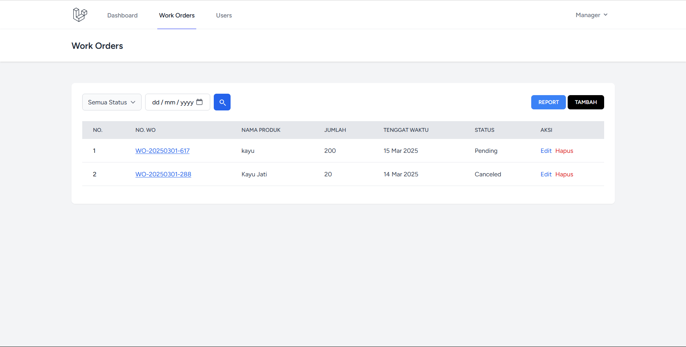
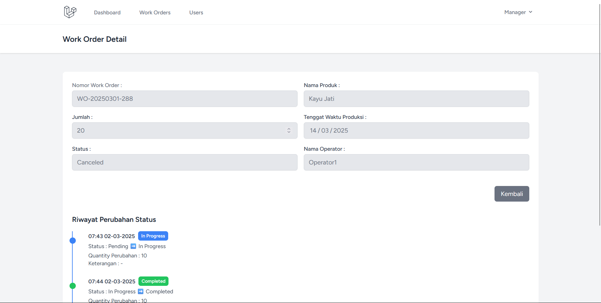
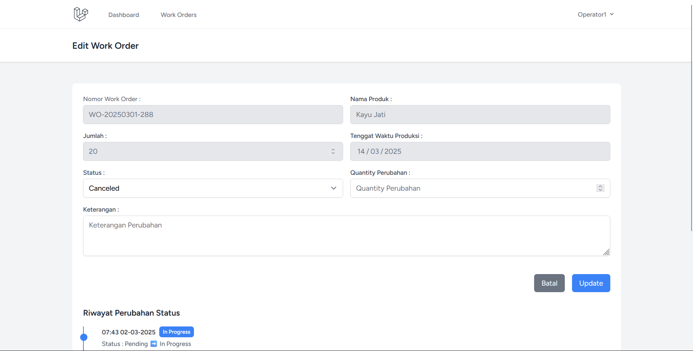

<p align="center"><a href="https://laravel.com" target="_blank"></a></p>

<p align="center">
<a href="https://github.com/laravel/framework/actions"></a>
<a href="https://packagist.org/packages/laravel/framework"></a>
<a href="https://packagist.org/packages/laravel/framework"></a>
<a href="https://packagist.org/packages/laravel/framework"></a>
</p>

# PMS (Production Management System) 🚀

PMS adalah sistem manajemen produksi berbasis web yang dibangun menggunakan Laravel 11. Sistem ini memungkinkan Production Manager untuk membuat, memperbarui, dan memantau work order, serta memberikan akses kepada Operator untuk memperbarui status produksi.

## Fitur Utama 📋

1. **Role-Based Access Control (RBAC)**

    - **Production Manager:** Membuat work order, menetapkan operator, memperbarui status, melihat laporan.
    - **Operator:** Melihat work order yang ditugaskan, memperbarui status dari **Pending** ke **In Progress** atau **In Progress** ke **Completed**, serta mencatat jumlah quantity.

2. **Manajemen Work Order**

    - Membuat, memperbarui, dan melihat daftar work order dengan filter status dan tanggal.

3. **Pelacakan Progres Work Order** (Opsional)

    - Mencatat tahapan produksi dan waktu setiap status work order.

4. **Laporan** (Opsional)
    - Rekapitulasi work order dan performa operator.

## 📸 Tampilan Sistem

1. **Tampilan Work Order Manager**
   

2. **Detail Work Order Manager**
   

3. **Work Order Operator**
   

## 🛠️ Instalasi

### 1. Clone Repository

```bash
git clone https://github.com/RizalPradanaaa/pms.git
cd pms
```

### 2. Install Dependencies

```bash
composer install
npm install
npm run dev
```

### 3. Setup Environment

Buat file `.env` dan sesuaikan konfigurasi database:

```env
DB_CONNECTION=mysql
DB_HOST=127.0.0.1
DB_PORT=3306
DB_DATABASE=pms
DB_USERNAME=root
DB_PASSWORD=
```

### 4. Generate Key & Migrasi Database

```bash
php artisan key:generate
php artisan migrate
php artisan db:seed --class=UserSeeder
```

### 5. Menjalankan Server

```bash
php artisan serve
```

Akses aplikasi di: [http://localhost:8000](http://localhost:8000)

## 🔑 Akun Default

-   **Manager:**
    -   Email: `manager@gmail.com`
    -   Password: `123456`
-   **Operator:**
    -   Email: `operator@gmail.com`
    -   Password: `123456`

## 📄 Lisensi

Aplikasi ini menggunakan lisensi [MIT](https://opensource.org/licenses/MIT).
